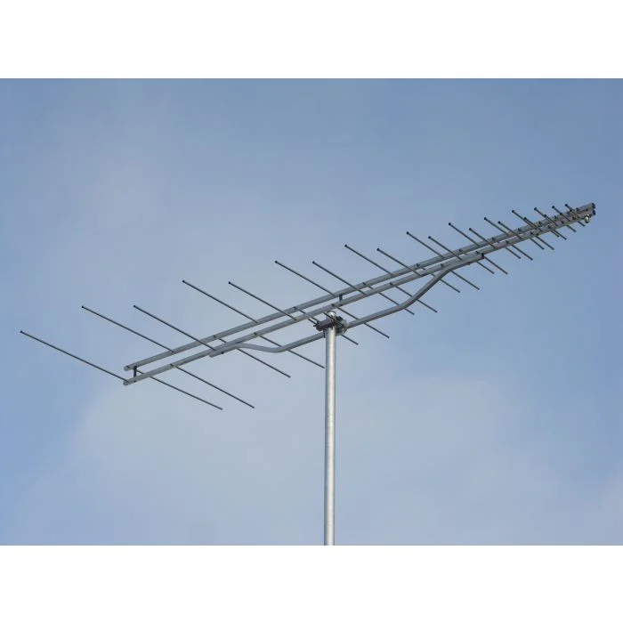

# EEC133 - Electromagnetic Radiation & Antenna Analysis

This repository contains notes and homework answers for EEC133 from the University of California, Davis in Fall 2024. This course studies how antenna physically transforms circuit parameters like voltage and current into free space electromagnetic waves. We also examined the characteristics of dipole, loop, and phase array antennas.

**Be aware that the homework answers might be incorrect. Use at your own discretion. The author does not have any responsibility over the consequences of using these materials.**
